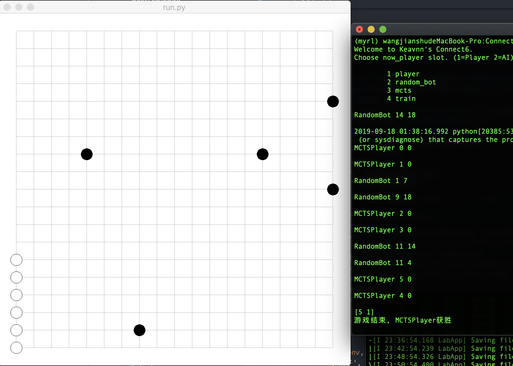
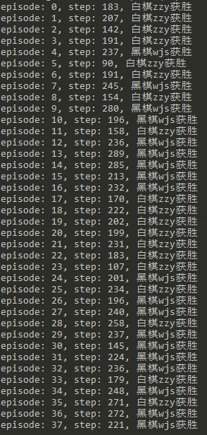

# Connect Six

这是一个连六棋小程序，用于训练AI智能体进行棋类游戏决策，最终实现人机对决，AI对决

简单运行一下，`python run.py`，默认了是两个随机策略，可以自行手动将`run.py`开头注释掉的代码更换掉，以手动控制下棋

规则：
- 黑棋先手，先下一子
- 每回合黑棋/白棋各走两步
- 首先有6个同色棋子相连的玩家获胜，相连规则可以是同一行、同一列、斜线

说明；
- 黑、白棋分别用`●`和`○`表示
- 黑、白棋的最新落子分别用`■`和`□`表示
- 人工对战时输入格式为`[number]-[number]`，如`9-7`会被解析成在第7行第9列落子(因为棋盘采取的是笛卡尔坐标系的第四象限)

目前界面如下:

训练演示如下:

## 需要用到的库

- python 3.6
- tensorflow-gpu 2.0
- gym

## 关于

该游戏环境逻辑脚本的代码借鉴了[therete/connect6-python](https://github.com/therne/connect6-python)的仓库